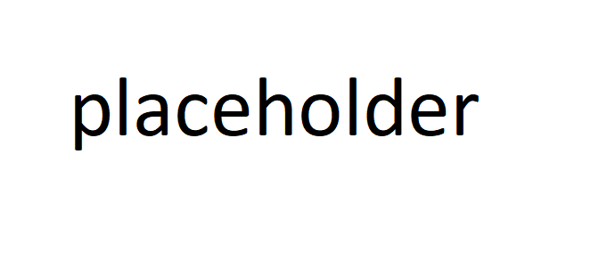

done for a special course given to future dev students

## Exercice 1
Aller dans le fichier index.html et mettez un titre comme ici
```
<!-- début exercice 1 -->
<h1>Mon site internet</h1>
<!-- fin exercice 1 -->
```
## Exercice 2
Aller dans le fichier index.html et mettez un titre comme ici
```
<!-- début exercice 2 -->
<p>[votre introduction va ici]</p>
<!-- fin exercice 2 -->
```
## Exercice 3
Insérez l'image de votre choix comme ici
```
<!-- début exercice 3 -->

<!-- fin exercice 3 -->
```
## Exercice 4
Créez un bbouton et cliquez dessus pour voir la magie qui se produit
```
<!-- début exercice 4 -->
<button id="bouton">Appuis sur moi</button>
<!-- fin exercice 4 -->
```
## Exercice 5
Créez une zone de texte afin de pouvor y insérer du texte et appuyez sur le bouton précédemment crée dans l'exercice 4
```
<!-- début exercice 5 -->
<input type="text" id="textbox">
<!-- fin exercice 5 -->
```
## Exercice 6
ajouter un lien en ajoutant le contenu suivant dans `index.html`
```
<!-- début exercice 6 -->
<a href="deuxiemePage.php">ma deuxième page</a>
<!-- fin exercice 6 -->
```
## Exercice 7
Allez dans le fichier `codes/main.js` et faites aller le serpent comme ici.
```
// début exercice 6
Serpent.viens();
// fin exercice 6
```
## Exercice 8
Allez faire de même pour le chat dans le fichier `codes/main.js`
```
// début exercice 7
chat.viens();
chat.couleur("rouge");
// fin exercice 7
```
Vous pouvez choisir la couleur parmi les suivants
<ul>
<li>rouge</li>
<li>bleu</li>
<li>rose</li>
<li>orange</li>
</ul>
tout autre couleur sera définie en noir